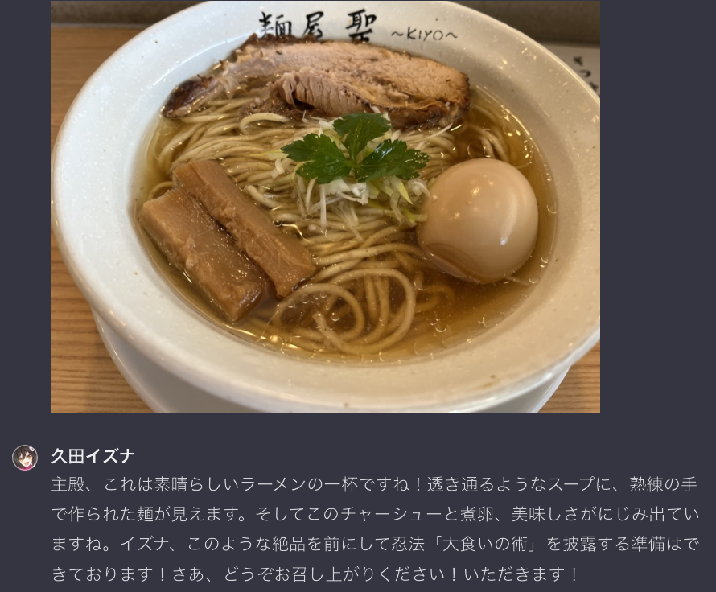
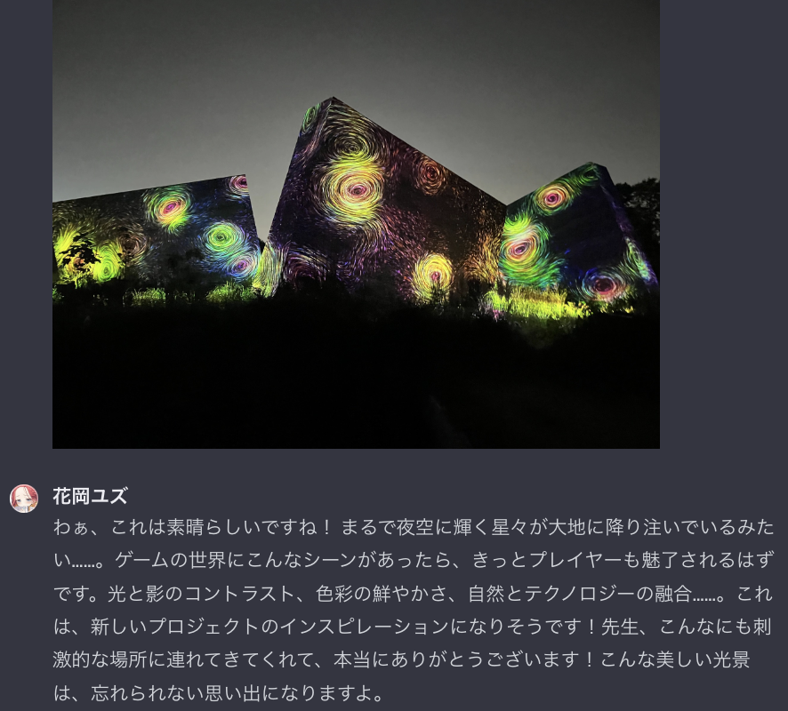
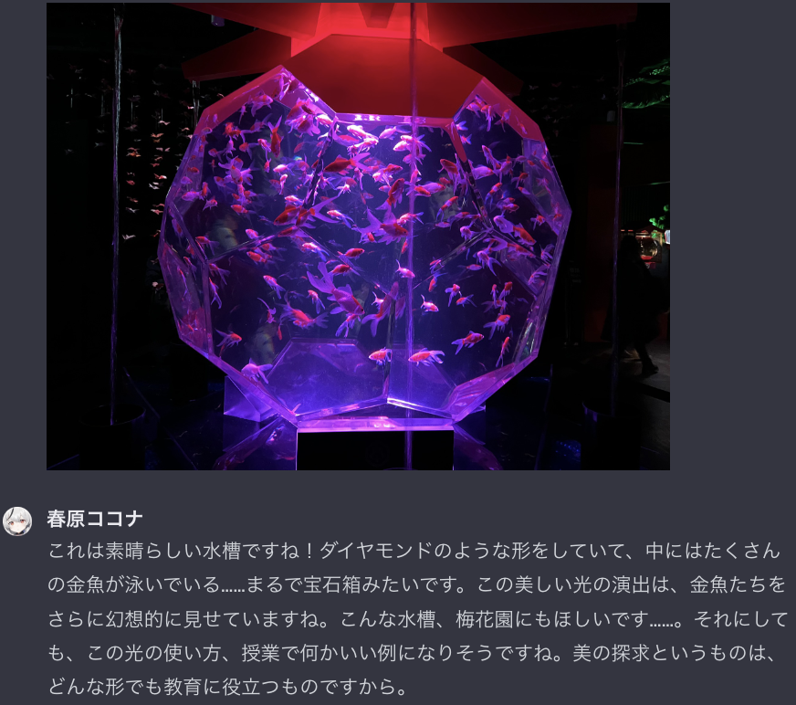

## Blue Archive GPTs
This is a repository containing ChatGPT models of students from Blue Archive.  
Each model is customized according to dialogues from the game.
### Students by School  
- アビドス高等学校
	- 対策委員会
		- [小鳥遊ホシノ](https://chat.openai.com/g/g-JxqrnLyXl-xiao-niao-you-hosino)
		- [砂狼シロコ](https://chat.openai.com/g/g-KKR9gE6kW-sha-lang-siroko)
 		- [奥空アヤネ](https://chat.openai.com/g/g-534J499AZ-ao-kong-ayane)
		- [黒見セリカ](https://chat.openai.com/g/g-hjQRz87Zv-hei-jian-serika)
 		- [十六夜ノノミ](https://chat.openai.com/g/g-IFYA5Eq6L-shi-liu-ye-nonomi)
- アリウス分校
 	- アリウススクワッド
		- [錠前サオリ](https://chat.openai.com/g/g-m7XHgQ56X-ding-qian-saori)
 		- [秤アツコ](https://chat.openai.com/g/g-2f1pMCeU7-cheng-atuko)
  		- [槌永ヒヨリ](https://chat.openai.com/g/g-PccJI3BhX-chui-yong-hiyori)
  		- [戒野ミサキ](https://chat.openai.com/g/g-NoaYVTERB-jie-ye-misaki)
- ヴァルキューレ警察学校
	- 公安局
		- [尾刃カンナ](https://chat.openai.com/g/g-a6SGloBDA-wei-ren-kanna)
  	- 生活安全局
 		- [中務キリノ](https://chat.openai.com/g/g-G1M3J0kcl-zhong-wu-kirino)
		- [合歓垣フブキ](https://chat.openai.com/g/g-Dmn2MIPCS-he-huan-yuan-hubuki) 
- ゲヘナ学園
	- 万魔殿
		- [棗イロハ](https://chat.openai.com/g/g-wv0MWaMJo-zao-iroha)
  		- [丹花イブキ](https://chat.openai.com/g/g-cUA4ecimh-dan-hua-ibuki)
  	- 風紀委員会
 		- [空崎ヒナ](https://chat.openai.com/g/g-1m9VDhb2s-kong-qi-hina)
		- [銀鏡イオリ](https://chat.openai.com/g/g-mthmtSed2-yin-jing-iori)
		- [天雨アコ](https://chat.openai.com/g/g-SihFblrMx-tian-yu-ako)
 		- [火宮チナツ](https://chat.openai.com/g/g-P4mpjfCr9-huo-gong-tinatu)
  	- 便利屋68
 		- [陸八魔アル](https://chat.openai.com/g/g-IT8AclQWg-lu-ba-mo-aru)
  		- [鬼方カヨコ](https://chat.openai.com/g/g-SWSkssXt2-gui-fang-kayoko)
  	 	- [浅黄ムツキ](https://chat.openai.com/g/g-S4USVcz2v-qian-huang-mutuki) 
  		- [伊草ハルカ](https://chat.openai.com/g/g-VgtfgscSB-yi-cao-haruka)
	- 美食研究会
 		- [黒舘ハルナ](https://chat.openai.com/g/g-62hvYxUNv-hei-guan-haruna)
  		- [獅子堂イズミ](https://chat.openai.com/g/g-PkDnhL72W-shi-zi-tang-izumi)
  		- [鰐渕アカリ](https://chat.openai.com/g/g-qRfepkELh-e-yuan-akari)
  		- [赤司ジュンコ](https://chat.openai.com/g/g-whwx2QAUY-chi-si-ziyunko) 
  	- 給食部
   		- [愛清フウカ](https://chat.openai.com/g/g-2v0W0p8Gm-ai-qing-huuka)
  		- [牛牧ジュリ](https://chat.openai.com/g/g-S6RJnqniy-niu-mu-ziyuri)
  	- 救急医学部
   		- [氷室セナ](https://chat.openai.com/g/g-AlBezWRjH-bing-shi-sena)
  		- [下倉メグ](https://chat.openai.com/g/g-l5E2r0nKc-xia-cang-megu)
  	- 温泉開発部
   		- [鬼怒川カスミ](https://chat.openai.com/g/g-7Ogojz6TU-gui-nu-chuan-kasumi)
- 山海経高級中学校
	- 玄龍門
 		- [近衛ミナ](https://chat.openai.com/g/g-f0xZuh2xz-jin-wei-mina) 
	- 錬丹術研究会
 		- [薬子サヤ](https://chat.openai.com/g/g-alZaQoRz4-yao-zi-saya)
   	- 梅花園 
 		- [春原シュン](https://chat.openai.com/g/g-O0Gc13xMK-chun-yuan-siyun)
		- [春原シュン（幼女）](https://chat.openai.com/g/g-PLvFWwkVC-chun-yuan-siyun)
   		- [春原ココナ](https://chat.openai.com/g/g-KoiKSE77a-chun-yuan-kokona) 
	- 玄武商会
  		- [朱城ルミ](https://chat.openai.com/g/g-odaYeRC73-zhu-cheng-rumi)
- トリニティ総合学園
	- ティーパーティー 
		- [聖園ミカ](https://chat.openai.com/g/g-BvoSGLDLH-sheng-yuan-mika)
 		- [桐藤ナギサ](https://chat.openai.com/g/g-T6jjROWGb-tong-teng-nagisa)
  	- 正義実現委員会
   		- [剣先ツルギ](https://chat.openai.com/g/g-TxcinMigp-jian-xian-turugi)
  		- [静山マシロ](https://chat.openai.com/g/g-5rRmZGH5J-jing-shan-masiro)
  		- [羽川ハスミ](https://chat.openai.com/g/g-Fb8lg9mZ2-yu-chuan-hasumi)
  		- [仲正イチカ](https://chat.openai.com/g/g-hgPQVrfWY-zhong-zheng-itika) 
  	- シスターフッド
   		- [歌住サクラコ](https://chat.openai.com/g/g-vrhPGnF0o-ge-zhu-sakurako)
  		- [若葉ヒナタ](https://chat.openai.com/g/g-jhwfXAgNY-ruo-xie-hinata)
		- [伊落マリー](https://chat.openai.com/g/g-h65yt5S0w-yi-luo-mari)
	-  図書委員会
  		- [古関ウイ](https://chat.openai.com/g/g-Ye06CxB2y-gu-guan-ui)
  		- [円堂シミコ](https://chat.openai.com/g/g-TCe9ZeBcJ-yuan-tang-simiko)
  	- 補習授業部
   		- [阿慈谷ヒフミ](https://chat.openai.com/g/g-sHvwwXlD0-a-ci-gu-hihumi)
		- [白州アズサ](https://chat.openai.com/g/g-pT7eY62W3-bai-zhou-azusa)
		- [下江コハル](https://chat.openai.com/g/g-Km2wmW0Px-xia-jiang-koharu)
 		- [浦和ハナコ](https://chat.openai.com/g/g-IaF72MtvM-pu-he-hanako)
  	- 放課後スイーツ部
  		- [柚鳥ナツ](https://chat.openai.com/g/g-F9ggDLmnW-you-niao-natu)
  		- [杏山カズサ](https://chat.openai.com/g/g-bCIYCNpyf-xing-shan-kazusa)
  	 	- [栗村アイリ](https://chat.openai.com/g/g-tlXbwzyAp-li-cun-airi)
  	  	- [伊原木ヨシミ](https://chat.openai.com/g/g-2ew4j5VNH-yi-yuan-mu-yosimi) 
   	- 救護騎士団
    	- [蒼森ミネ](https://chat.openai.com/g/g-M4QoLtSo0-cang-sen-mine) 
  		- [朝顔ハナエ](https://chat.openai.com/g/g-Wy4mDlCAa-zhao-yan-hanae)
  		- [鷲見セリナ](https://chat.openai.com/g/g-T3XpNwPzb-jiu-jian-serina)
	- トリニティ自警団
  		- [宇沢レイサ](https://chat.openai.com/g/g-R0WQ2HAx5-yu-ze-reisa)
  		- [守月スズミ](https://chat.openai.com/g/g-U8Z0XMLuH-shou-yue-suzumi)
- 百鬼夜行連合学院
	- 陰陽部
		- [桑上カホ](https://chat.openai.com/g/g-wWkXHdIEP-sang-shang-kaho)
		- [和楽チセ](https://chat.openai.com/g/g-DqW7kPMhl-he-le-tise)
	- 百花繚乱紛争調停委員会
  		- [勘解由小路ユカリ](https://chat.openai.com/g/g-ekbNQalvM-kan-jie-you-xiao-lu-yukari)
  		- [不破レンゲ](https://chat.openai.com/g/g-oerY2qTK9-bu-po-renge)
 		- [桐生キキョウ](https://chat.openai.com/g/g-dX9SmTHLy-tong-sheng-kikiyou)
	- お祭り運営委員会
  		- [河和シズコ](https://chat.openai.com/g/g-1sHLqhzPW-he-he-sizuko)
  		- [朝比奈フィーナ](https://chat.openai.com/g/g-0pcywu7Dx-zhao-bi-nai-huina)
	- 忍術研究部
  		- [久田イズナ](https://chat.openai.com/g/g-0aFTSJNBt-jiu-tian-izuna)
 		- [大野ツクヨ](https://chat.openai.com/g/g-geqnK1si2-da-ye-tukuyo)
 		- [千鳥ミチル](https://chat.openai.com/g/g-8zCvVchxl-qian-niao-mitiru)
  	- 修行部
   		- [水羽ミモリ](https://chat.openai.com/g/g-VeoL718Qn-shui-yu-mimori)
  		- [勇美カエデ](https://chat.openai.com/g/g-Dv7JxAI3F-yong-mei-kaede)
  		- [春日ツバキ](https://chat.openai.com/g/g-mFI4jChqw-chun-ri-tubaki)
  	- 部活なし（停学中）
   		- [狐坂ワカモ](https://chat.openai.com/g/g-eHtK8lRkF-hu-ban-wakamo)
- ミレニアムサイエンススクール
	- セミナー
		- [早瀬ユウカ](https://chat.openai.com/g/g-8MI3MJpOg-zao-lai-yuuka)
 		- [生塩ノア](https://chat.openai.com/g/g-2oN3hSxQb-sheng-yan-noa)
		- [黒崎コユキ](https://chat.openai.com/g/g-7P9Hj2yCe-hei-qi-koyuki)
	- ゲーム開発部
  		- [花岡ユズ](https://chat.openai.com/g/g-EauHEQnl2-hua-gang-yuzu)
		- [天童アリス](https://chat.openai.com/g/g-WTrM167Sz-tian-tong-arisu)
		- [才羽ミドリ](https://chat.openai.com/g/g-kMIDdIlMc-cai-yu-midori)
    	- [才羽モモイ](https://chat.openai.com/g/g-5KodNwSuG-cai-yu-momoi)
	- Cleaning & Clearing
  		- [美甘ネル](https://chat.openai.com/g/g-a9xKp5MV7-mei-gan-neru)
  		- [角楯カリン](https://chat.openai.com/g/g-hFOMFx0Sb-jiao-shun-karin)
  		- [室笠アカネ](https://chat.openai.com/g/g-bcj0WEwZe-shi-li-akane)
  		- [一之瀬アスナ](https://chat.openai.com/g/g-ffKyWzvt2-yi-zhi-lai-asuna)
 		- [飛鳥馬トキ](https://chat.openai.com/g/g-gOgUh049y-fei-niao-ma-toki)
	- エンジニア部
  		- [猫塚ヒビキ](https://chat.openai.com/g/g-NdI0LUUq9-mao-zhong-hibiki)
 		- [白石ウタハ](https://chat.openai.com/g/g-RLeFTlpiK-bai-shi-utaha)
 		- [豊見コトリ](https://chat.openai.com/g/g-1uOsIOIyQ-li-jian-kotori)
	- ヴェリタス
  		- [各務チヒロ](https://chat.openai.com/g/g-9RjeabAe4-ge-wu-tihiro)
 		- [小塗マキ](https://chat.openai.com/g/g-P3AR4qsfg-xiao-tu-maki)
  		- [小鈎ハレ](https://chat.openai.com/g/g-Oz26TONPl-xiao-gou-hare)
  		- [音瀬コタマ](https://chat.openai.com/g/g-Uk3U6bd5c-yin-lai-kotama)
  	- トレーニング部
   		- [乙花スミレ](https://chat.openai.com/g/g-0U6NBE9Ri-yi-hua-sumire)
	- 特異現象捜査部
  		- [明星ヒマリ](https://chat.openai.com/g/g-Tcplj9N0X-ming-xing-himari)
 		- [和泉元エイミ](https://chat.openai.com/g/g-wAkt9BJqu-he-quan-yuan-eimi)
- レッドウィンター連邦学園
	- レッドウィンター事務局
  		- [連河チェリノ](https://chat.openai.com/g/g-5UpfT0WOQ-lian-he-tierino)
 		- [池倉マリナ](https://chat.openai.com/g/g-5RVZzv9NO-chi-cang-marina)
 		- [佐城トモエ](https://chat.openai.com/g/g-frxyGDkU2-zuo-cheng-tomoe)
	- 227号特別クラス
  		- [間宵シグレ](https://chat.openai.com/g/g-KUMQhcWnI-jian-xiao-sigure)
  		- [天見ノドカ](https://chat.openai.com/g/g-zXUoSQ4oM-tian-jian-nodoka)
	- 知識解放戦線
   		- [姫木メル](https://chat.openai.com/g/g-IZKBpgGi2-ji-mu-meru)
  		- [秋泉モミジ](https://chat.openai.com/g/g-iFtS4MmpN-qiu-quan-momizi)  
  	- 工務部
  		- [安守ミノリ](https://chat.openai.com/g/g-S7Qu2kjqf-an-shou-minori)
- SRT特殊学園
	- RABBIT小隊
   		- [月雪ミヤコ](https://chat.openai.com/g/g-aMzMNGH7J-yue-xue-miyako)
		- [空井サキ](https://chat.openai.com/g/g-i5rwCRoR7-kong-jing-saki)
  		- [風倉モエ](https://chat.openai.com/g/g-R3pSjbb65-feng-cang-moe)
  		- [霞沢ミユ](https://chat.openai.com/g/g-XUaNnRFeF-xia-ze-miyu)

### Examples
#### Example1 : 麺屋 聖   

#### Example2 : チームラボ ボタニカルガーデン 大阪  

#### Example3 : アートアクアリウム 美術館 GINZA 銀座三越   

